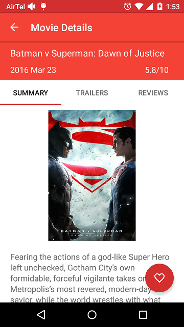
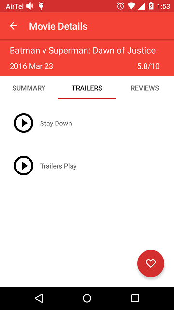

# PopularMovies
Popular Movies App for my Android Nano Degree.

<b>Notes:</b>

TMDB API KEY is required.

In order for the Movies app to function properly,get API key from https://www.themoviedb.org/.

Also add following line to [USER_HOME]/.gradle/gradle.properties file.

TheMovieDBAPIKey="YOUR_UNIQUE_API_KEY"

 

 

